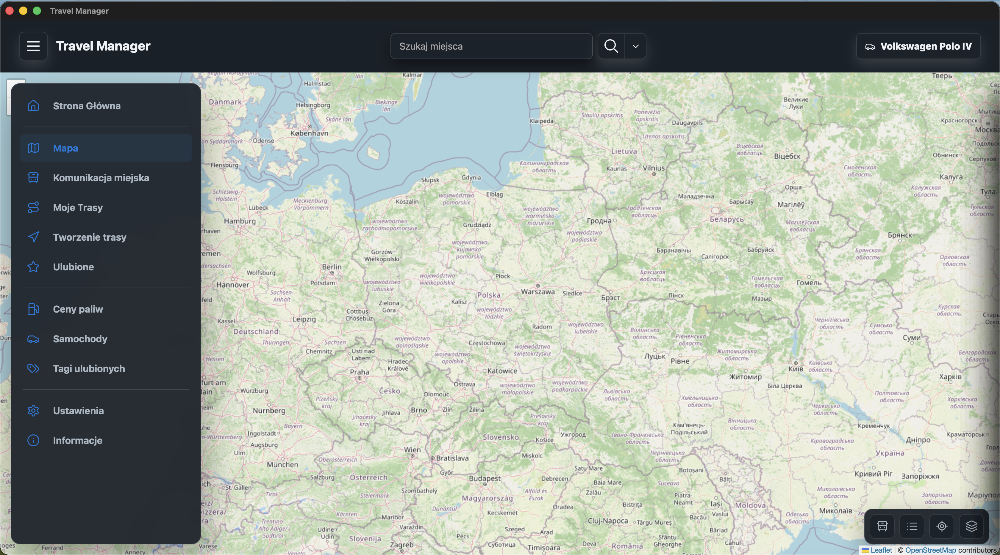
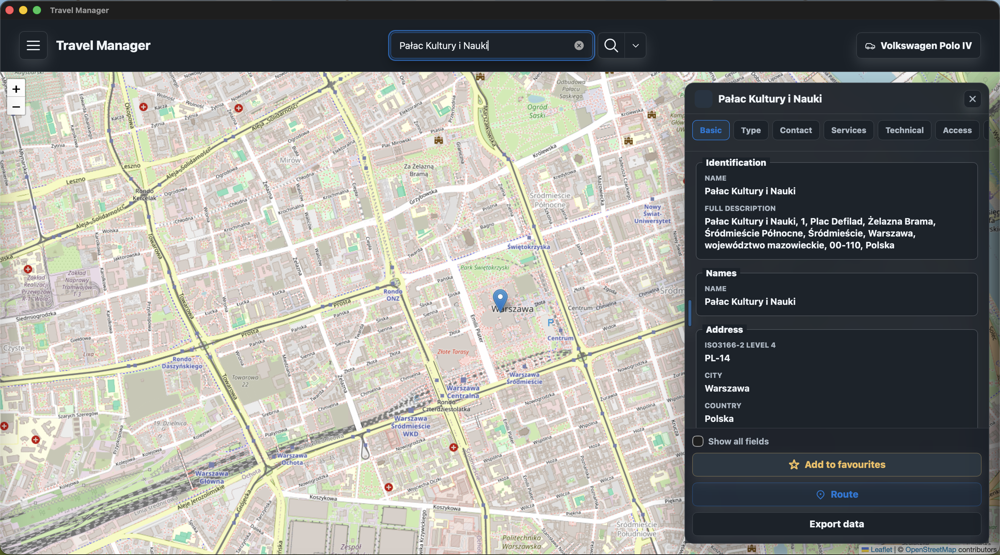
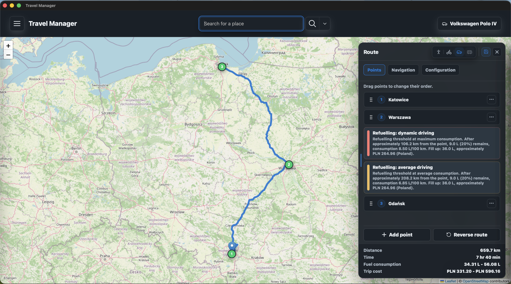
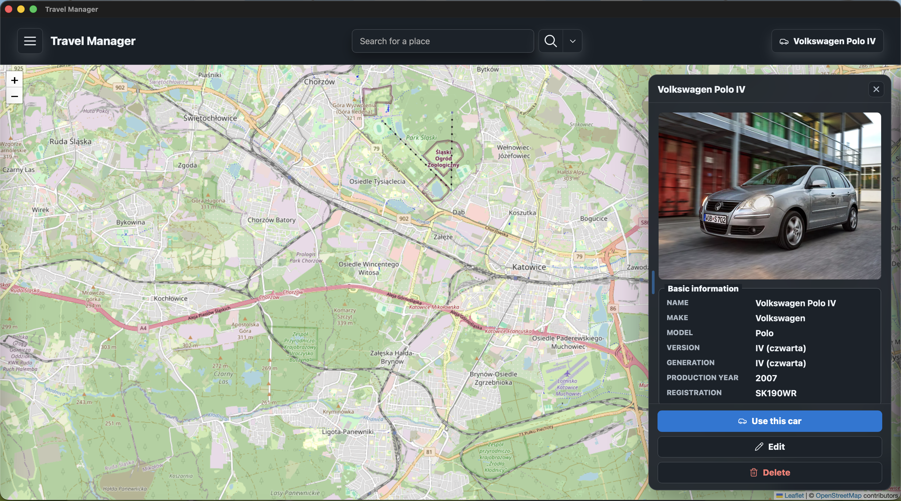
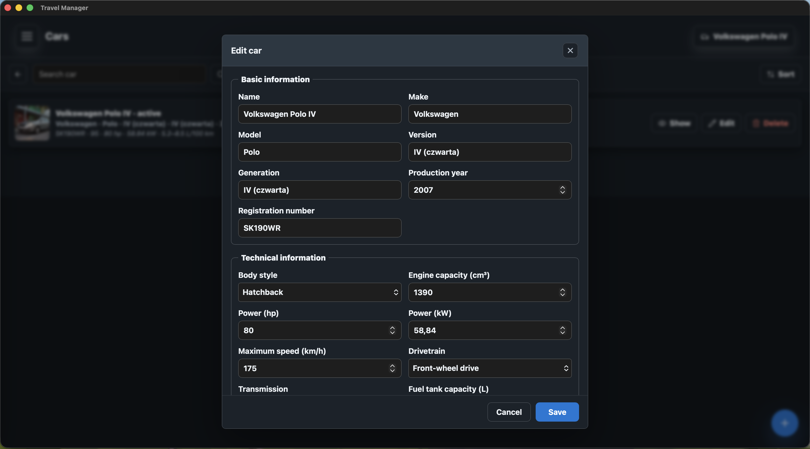
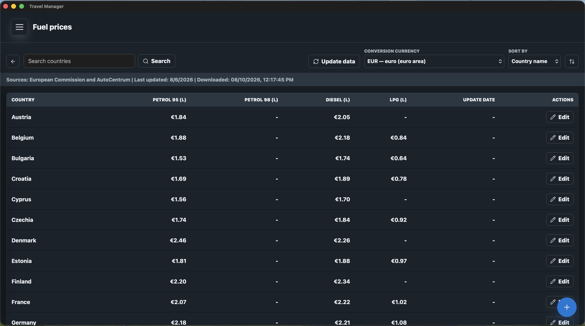
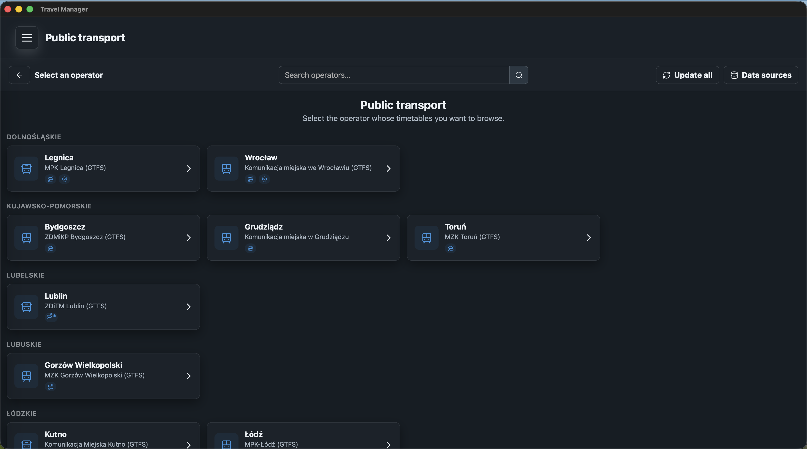
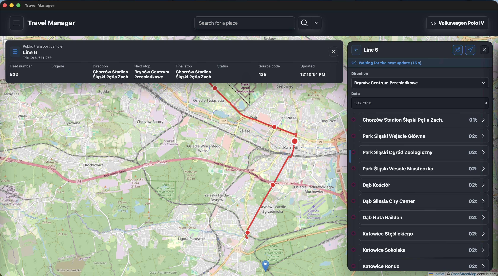

# Travel Manager

Travel Manager łączy w jednej aplikacji mapy, wyszukiwanie miejsc, planowanie tras, profile samochodów, koszty podróży i polską komunikację miejską. Działa w natywnym oknie desktopowym, a jego interfejs można również udostępnić w przeglądarce w zaufanej sieci lokalnej.

[English documentation](README.md)



> Screeny mają charakter poglądowy. Wyświetlane dane, dostępne funkcje operatorów, kolory i język interfejsu mogą się różnić zależnie od ustawień oraz zewnętrznych źródeł danych.

## Możliwości aplikacji

- Przeglądanie OpenStreetMap w stylu standardowym, rowerowym i humanitarnym.
- Wyszukiwanie miejsc według nazwy lub kategorii i przeglądanie szczegółowych informacji OpenStreetMap.
- Wyświetlanie ulubionych miejsc, notatek OpenStreetMap, obiektów mapy i publicznych śladów GPS jako opcjonalnych warstw.
- Tworzenie tras samochodowych, rowerowych i pieszych, zmiana kolejności punktów, odwracanie i zapisywanie tras.
- Szacowanie zużycia paliwa i kosztu podróży na podstawie aktywnego profilu samochodu oraz cen paliw w poszczególnych krajach.
- Dodawanie punktów tankowania dla ekonomicznego, średniego i dynamicznego stylu jazdy.
- Wyznaczanie tras samochodowych omijających drogi płatne, jeżeli pozwala na to usługa routingu.
- Prowadzenie szczegółowych profili samochodów ze zdjęciem, danymi technicznymi, paliwami, spalaniem i wpisami przebiegu.
- Przeglądanie cen paliw w Polsce i innych krajach Europy, przeliczanie walut i wprowadzanie własnych wartości.
- Przeglądanie operatorów komunikacji miejskiej, linii, przystanków, rozkładów, przejazdów, komunikatów i pozycji pojazdów, jeśli operator je udostępnia.
- Porządkowanie ulubionych miejsc za pomocą własnych tagów, kolorów i emoji.
- Importowanie i eksportowanie tras, ulubionych i tagów, samochodów oraz cen paliw w plikach JSON.
- Wybór języka polskiego lub angielskiego oraz personalizacja motywu, akcentu, tras i kolorów komunikacji miejskiej.

## Mapa i miejsca

Pole wyszukiwania pozwala znaleźć adres lub miejsce. Wyszukiwanie zaawansowane może ograniczyć wyniki do kategorii OpenStreetMap, a kliknięcie mapy wykonuje wyszukiwanie odwrotne. Panel miejsca grupuje identyfikację, adres, kontakt, usługi, dostęp i tagi techniczne. Wybrane miejsce można dodać do ulubionych, wykorzystać jako punkt trasy albo wyeksportować do JSON.



Panel warstw steruje mapą bazową, tagami ulubionych, notatkami OpenStreetMap, obiektami w bieżącym obszarze i publicznymi śladami GPS. Legenda objaśnia obsługiwane symbole, linie i obszary.

## Trasy i samochody

Trasa może zawierać od 2 do 25 uporządkowanych punktów. Panel trasy obsługuje ruch pieszy, rowerowy i samochodowy, zmianę kolejności, odwracanie trasy, instrukcje przejazdu, zapis oraz opcję omijania dróg płatnych. Dla trasy samochodowej aktywny profil dostarcza rodzaj paliwa, pojemność zbiornika i spalanie potrzebne do szacowania kosztów oraz tankowań.



Profile samochodów przechowują dane użytkowe i techniczne. Profil można ustawić jako aktywny, edytować, przypisać mu zdjęcie albo usunąć.





## Ceny paliw i koszty podróży

Widok cen paliw zawiera ceny benzyny 95, benzyny 98, oleju napędowego i LPG według kraju. Dane można odświeżać, wyszukiwać, sortować, przeliczać na inną walutę i ręcznie nadpisywać. Travel Manager używa wybranego paliwa oraz minimalnego i maksymalnego spalania aktywnego samochodu do obliczenia zakresu kosztu trasy.



Dane automatyczne pochodzą obecnie z Weekly Oil Bulletin Komisji Europejskiej, AutoCentrum dla Polski oraz kursów Frankfurter. Dostępność i daty aktualizacji zależą od działania tych usług.

## Komunikacja miejska

Travel Manager ma skonfigurowane integracje dla 35 obszarów polskiej komunikacji miejskiej. Operatorzy są pogrupowani pod oryginalnymi polskimi nazwami miast, województw i przedsiębiorstw. Można aktualizować dane podręczne, przeglądać linie, przystanki, rozkłady i przejazdy oraz otwierać obsługiwane przebiegi na mapie.



Część operatorów udostępnia także komunikaty, stanowiska, bieżące lub ostatnio zgłoszone pozycje pojazdów, szczegóły pojazdów i geometrię przebiegu. Zakres funkcji zależy od dostawcy; interfejs pokazuje tylko możliwości obsługiwane przez wybrane źródło.



## Pierwsze uruchomienie i ustawienia

Dla nowej konfiguracji domyślnym językiem jest angielski, a po uruchomieniu otwierana jest Strona Główna. Język można zmienić w headerze Strony Głównej lub w sekcji **Ustawienia → Aplikacja**.

Ustawienia są podzielone na:

- **Wygląd** — jasny lub ciemny motyw, kolor akcentu, kolory trasy oraz osobne kolory znaczników autobusów, tramwajów, trolejbusów, metra i pociągów.
- **Trasy** — waluta kosztów, domyślne dane cen i spalania, znaczniki tankowania oraz obsługa dróg płatnych.
- **Komunikacja miejska** — aktualizacje pojazdów w tle i częstotliwość odświeżania.
- **Kopia zapasowa** — import i eksport wybranych kategorii danych w formacie JSON.
- **Aplikacja** — język, otwieranie Strony Głównej i tryb sieci lokalnej.

## Wymagania

- Python 3.10 lub nowszy przy uruchamianiu ze źródeł.
- Dostęp do Internetu potrzebny do kafelków mapy, wyszukiwania miejsc, wyznaczania tras, aktualizacji paliw i walut oraz pobierania komunikacji miejskiej.
- Silnik WebView obsługiwany przez pywebview:
  - WebView2 albo obsługiwany backend Qt w Windows,
  - natywny WebKit w macOS,
  - WebKitGTK albo obsługiwany backend Qt w Linux.

Dystrybucje Linux mogą wymagać doinstalowania pakietów WebKitGTK lub Qt za pomocą systemowego menedżera pakietów.

## Instalacja ze źródeł

Sklonuj repozytorium, przejdź do jego katalogu i utwórz środowisko wirtualne:

```bash
python3 -m venv .venv
```

Aktywuj je w Linux lub macOS:

```bash
source .venv/bin/activate
```

Aktywuj je w Windows:

```powershell
.venv\Scripts\activate
```

Zainstaluj zależności:

```bash
python -m pip install -r requirements.txt
```

## Uruchamianie

Użyj skryptu odpowiedniego dla platformy:

```bash
./run.sh
```

lub w Windows:

```bat
run.bat
```

Aplikację można również uruchomić bezpośrednio:

```bash
python app.py
```

Domyślnie lokalna usługa nasłuchuje pod adresem `http://127.0.0.1:5000` i otwiera się w oknie desktopowym.

### Parametry linii poleceń

| Parametr | Wariant Windows | Znaczenie |
|---|---|---|
| `--ip ADRES` | `/ip ADRES` | Adres IPv4, pod którym nasłuchuje usługa. |
| `--port PORT` | `/port PORT` | Port TCP z zakresu `1–65535`. |
| `--lang {EN,PL}` | `/lang {EN,PL}` | Wymusza język aplikacji dla bieżącego uruchomienia bez zmiany zapisanych ustawień. |
| `--no-window` | `/no-window` | Uruchamia usługę HTTP bez natywnego okna. |
| `--help`, `-h` | `/help`, `/h` | Wyświetla przetłumaczoną pomoc CLI. |

Przykład:

```bash
python app.py --ip 192.168.1.20 --port 8080 --no-window
```

Te same parametry można przekazać do `run.sh` albo `run.bat`. W trybie `--no-window` otwórz wyświetlony adres w przeglądarce, a usługę zatrzymaj kombinacją `Ctrl+C`.

Powiązanie usługi z adresem innym niż localhost udostępnia aplikację i lokalnie zapisane dane innym urządzeniom w tej sieci. Używaj tej możliwości tylko w zaufanej sieci. Opcja **Przenieś do sieci** może po ponownym uruchomieniu wybrać aktywny interfejs sieciowy; jawny adres CLI ma pierwszeństwo.

## Dane lokalne i prywatność

Stan aplikacji jest zapisywany w `settings.json` w systemowym katalogu konfiguracji:

| System | Lokalizacja |
|---|---|
| Windows | `%APPDATA%\TravelManager\settings.json` |
| macOS | `~/Library/Application Support/TravelManager/settings.json` |
| Linux | `$XDG_CONFIG_HOME/TravelManager/settings.json` lub `~/.config/TravelManager/settings.json` |

Plik zawiera ustawienia użytkownika, geometrię okna, wygląd, trasy, ulubione, tagi, profile samochodów, dane paliwowe i pamięć podręczną komunikacji miejskiej. Zapis jest chroniony blokadą i atomowo zastępuje plik docelowy.

Wyszukiwane frazy, współrzędne, punkty tras i żądania związane z konkretną funkcją są wysyłane do odpowiednich usług zewnętrznych. Dane komunikacji miejskiej i paliw są przechowywane lokalnie w pamięci podręcznej. Importowane pliki JSON powinny pochodzić z zaufanego źródła, szczególnie jeśli usługa jest dostępna w sieci.

## Informacje techniczne

### Architektura działania

```text
app.py
├── CommandLineManager          parser CLI, walidacja i tłumaczone komunikaty
├── Service                     lokalny wielowątkowy serwer Flask/Werkzeug
│   ├── controllers/            strony i endpointy API JSON
│   ├── services/               usługi domenowe aplikacji
│   ├── templates/              widoki, panele i dialogi Jinja
│   └── assets/                 JavaScript, CSS, ikony i katalogi tłumaczeń
├── SettingsStorage             typowany zapis JSON oraz import i eksport danych
└── WebViewWindow               natywne okno i most JavaScript
```

Interfejs przeglądarkowy pobiera fragmenty widoków i dane JSON z lokalnej usługi Flask. Kontrolery walidują dane na granicy API i przekazują pobieranie, konwersję, zapis oraz mapowanie zasobów do odpowiednich klas. Ta sama usługa może być wyświetlana przez pywebview lub otwarta w zwykłej przeglądarce.

### Technologie

- Python, Flask, Werkzeug i Jinja jako lokalna usługa i renderowane po stronie serwera fragmenty.
- pywebview jako natywne okno desktopowe i most do systemowych okien wyboru plików.
- Czysty JavaScript i CSS jako interfejs klienta.
- Leaflet i Lucide dostarczane z aplikacją w `assets/vendor`.
- OpenStreetMap, Nominatim, Overpass, usługi zgodne z OSRM i Valhalla dla map oraz tras.
- GTFS, GTFS Realtime, API operatorów i dedykowane źródła HTML/JSON dla komunikacji miejskiej.
- Dane Komisji Europejskiej, AutoCentrum i Frankfurter dla paliw oraz walut.
- PyInstaller do tworzenia paczek dla poszczególnych systemów.

Dane zewnętrzne pozostają własnością ich dostawców i mogą podlegać odrębnym zasadom dostępności, użycia oraz atrybucji.

### Struktura projektu

```text
app.py             Składanie komponentów i cykl życia aplikacji
config.py          Metadane, ścieżki zasobów, domyślny host i port
controllers/       Kontrolery stron i API JSON Flask
core/              Usługa, i18n, bazowe klasy API/danych i okno WebView
services/          Usługi domenowe współdzielone przez kontrolery
models/            Typowane modele mapy, tras, transportu, ustawień i transferu
storage/           Wielowątkowo bezpieczny zapis ustawień
resources/         Stałe słowniki, enumy, menu i metadane źródeł
utils/             Downloadery, konwertery, CLI, audyt języków i narzędzia runtime
templates/         Indeks Jinja, widoki, headery, panele i dialogi
assets/            JavaScript, CSS, języki, ikony, obrazy i biblioteki vendor
tests/             Testy jednostkowe i regresyjne
doc/               Screeny dokumentacji i pliki pomocnicze
build.py           Budowanie i pakowanie aplikacji przez PyInstaller
```

### Konfiguracja

`config.py` zawiera `APP_NAME`, `APP_DESCRIPTION`, `APP_VERSION`, ścieżki aplikacji, `HOST`, `PORT` i limit czasu uruchomienia usługi. `build_conf.py` wyprowadza z tych wartości metadane paczek oraz ścieżki procesu budowania.

Ustawienia interfejsu działające w czasie wykonywania należą do typowanych modeli w `models/settings` i są zapisywane przez `SettingsStorage`; nie należy dodawać ich jako doraźnych stałych do `config.py`.

### Tłumaczenia

Katalogi tłumaczeń znajdują się w:

- `assets/languages/en_US.json`
- `assets/languages/pl_PL.json`

Angielski jest językiem zapasowym. Każdy katalog używa grup komponentów lub zasobów, a każdy segment klucza musi być stabilnym angielskim identyfikatorem `UPPER_CASE`, na przykład `PANEL_CAR_DETAILS.FUEL_TYPE`. Oba katalogi muszą zawierać te same klucze i nazwane parametry.

Używaj `t('GROUP.KEY')` w Jinja i JavaScript aplikacji, `translate('GROUP.KEY')` wewnątrz żądania Flask oraz `LanguageService` lub `CommandLineManager` poza kontekstem żądania. Nazwy własne polskich województw, miast i operatorów komunikacji miejskiej celowo pozostają w oryginalnej formie w obu językach.

Dynamiczne wzorce kluczy są śledzone przez rejestr oczekiwany w `doc/i18n_reserved_keys.txt`. Audyt wykrywa brakujące klucze, duplikaty JSON, niezgodne parametry, niepoprawne nazwy i nieużywane wpisy:

```bash
python3 utils/languages_manager.py
```

Aby dodać język, dodaj go w `resources/language_enum.py`, zarejestruj ścieżkę katalogu w `resources/language_definitions.py` i umieść etykietę `SETTINGS_APPLICATION.LANGUAGE_<NAZWA_ENUMU>` w każdym katalogu. Backend automatycznie przekazuje definicje do przeglądarki i selektorów języka.

### Testy

Pełny zestaw testów jednostkowych i regresyjnych uruchom poleceniem:

```bash
python3 -m unittest discover -s tests
```

Zestaw uruchamia także audyt języków, dlatego rejestr zastrzeżonych kluczy musi istnieć i być aktualny.

### Budowanie wydania

Zbuduj paczkę dla bieżącego systemu poleceniem:

```bash
./build.sh
```

lub w Windows:

```bat
build.bat
```

Proces usuwa wcześniejsze wyniki, instaluje lub aktualizuje zależności budowania, tworzy paczkę PyInstaller odpowiednią dla platformy i zapisuje ją w `bin/release`. Każdy system docelowy trzeba budować na tym systemie. Skrypty `cleanup.sh` i `cleanup.bat` usuwają pamięć podręczną kodu Pythona.

## Licencja

Copyright (C) Kamil Karpiński. Projekt jest dostępny na licencji [GNU General Public License v3.0](LICENSE).
