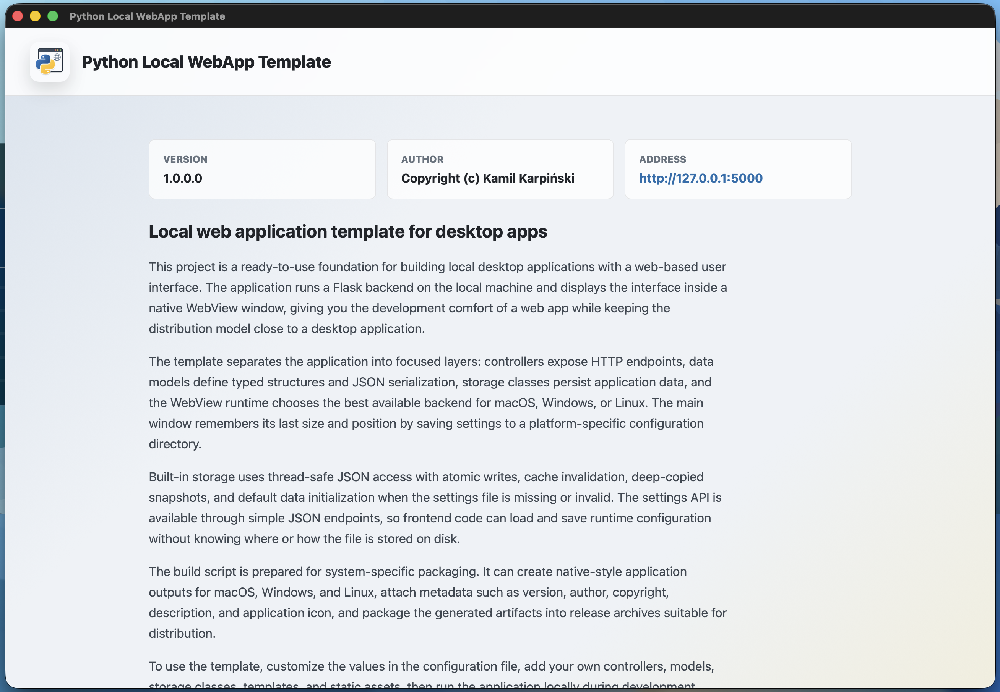

# Travel Manager

Travel Manager to wieloplatformowa aplikacja desktopowa do przeglądania danych OpenStreetMap, wyszukiwania miejsc, planowania tras i szacowania kosztów podróży. Łączy lokalny backend Flask z interfejsem internetowym wyświetlanym w natywnym oknie pywebview.



[English documentation](README.md)

## Funkcje

- Interaktywna mapa OpenStreetMap ze stylem standardowym, rowerowym i humanitarnym
- Wyszukiwanie miejsc, geokodowanie odwrotne, zaawansowane wyszukiwanie kategorii i szczegóły obiektów OSM
- Wyznaczanie tras dla samochodu, roweru i ruchu pieszego
- Obliczanie dystansu, czasu i geometrii trasy z użyciem alternatywnych usług routingu, gdy są dostępne
- Zapisywanie tras i ulubionych miejsc oraz porządkowanie ich własnymi tagami i emoji
- Profile samochodów z danymi pojazdu, rodzajem paliwa, spalaniem i historią przebiegu
- Szacowanie kosztu podróży na podstawie aktywnego profilu samochodu i cen paliw
- Ceny paliw dla Polski i krajów europejskich, ręczna edycja cen i przeliczanie walut
- Import i eksport tras, ulubionych, tagów oraz cen paliw w formacie JSON
- Zapamiętywanie ustawień interfejsu oraz rozmiaru i położenia okna
- Natywne kompilacje dla Windows, macOS i Linux z użyciem PyInstaller

## Technologie

- Python, Flask i Werkzeug jako lokalny backend
- pywebview jako natywne okno aplikacji
- HTML, CSS i czysty JavaScript jako interfejs
- Leaflet i Lucide pobierane z CDN
- Kafelki i dane OpenStreetMap, Nominatim, Overpass API, OSRM oraz usługi routingu OpenStreetMap
- AutoCentrum, Weekly Oil Bulletin Komisji Europejskiej i Frankfurter jako źródła cen paliw i kursów walut

## Wymagania

- Python 3.10 lub nowszy
- Dostęp do Internetu potrzebny do map, geokodowania, routingu, zewnętrznych bibliotek interfejsu i aktualizacji cen paliw
- Systemowy silnik WebView obsługiwany przez pywebview

Linux może wymagać dodatkowych pakietów GUI/WebKit dostarczanych przez daną dystrybucję. Szczegóły znajdują się w [instrukcji instalacji pywebview](https://pywebview.flowrl.com/guide/installation.html).

## Instalacja

Sklonuj repozytorium, przejdź do jego katalogu i utwórz środowisko wirtualne:

```bash
python3 -m venv .venv
```

Aktywuj je w systemie Linux lub macOS:

```bash
source .venv/bin/activate
```

W systemie Windows:

```powershell
.venv\Scripts\activate
```

Zainstaluj zależności:

```bash
python -m pip install -r requirements.txt
```

## Uruchamianie

Uruchom skrypt odpowiedni dla platformy:

```bash
./run.sh
```

lub w systemie Windows:

```bat
run.bat
```

Aplikację można też uruchomić bezpośrednio:

```bash
python app.py
```

Usługa Flask domyślnie nasłuchuje lokalnie pod adresem `http://127.0.0.1:5000` i jest automatycznie otwierana w oknie aplikacji.

Adres aktywnej karty sieciowej może być wybierany automatycznie po włączeniu opcji **Ustawienia → Aplikacja → Przenieś do sieci**. Zmiana zaczyna obowiązywać po ponownym uruchomieniu aplikacji. Jawnie podany parametr `--ip` lub `/ip` ma pierwszeństwo przed tym ustawieniem.

Adres i port można zmienić podczas uruchamiania. Aby udostępnić aplikację innym urządzeniom w sieci lokalnej, podaj adres IPv4 komputera i uruchom ją bez okna:

```bash
python app.py --ip 192.168.1.20 --port 8080 --no-window
```

Skrypty platformowe również przekazują parametry do aplikacji:

```bash
./run.sh --ip 192.168.1.20 --port 8080 --no-window
```

W systemie Windows można używać zarówno składni `--opcja`, jak i `/opcja`:

```bat
run.bat /ip 192.168.1.20 /port 8080 /no-window
```

| Parametr | Wariant Windows | Znaczenie |
|---|---|---|
| `--ip ADRES` | `/ip ADRES` | Adres IPv4, pod którym serwer ma nasłuchiwać. |
| `--port PORT` | `/port PORT` | Port z zakresu 1–65535. |
| `--no-window` | `/no-window` | Uruchamia sam serwer, bez okna WebView. |
| `--help`, `-h` | `/help`, `/h` | Wyświetla pomoc i kończy działanie. |

W trybie `--no-window` terminal wyświetla adres aplikacji. Interfejs należy otworzyć w przeglądarce, a serwer zatrzymać kombinacją `Ctrl+C`. Udostępnienie usługi poza localhostem umożliwia dostęp do danych aplikacji innym urządzeniom w tej samej sieci, dlatego należy korzystać wyłącznie z zaufanej sieci.

## Dane i prywatność

Dane aplikacji są zapisywane lokalnie w pliku `settings.json` w systemowym katalogu konfiguracji aplikacji:

- Windows: `%APPDATA%\TravelManager`
- macOS: `~/Library/Application Support/TravelManager`
- Linux: `$XDG_CONFIG_HOME/TravelManager` lub `~/.config/TravelManager`

Zapisywane dane obejmują ulubione miejsca, tagi, trasy, profile samochodów, pamięć podręczną cen paliw, ustawienia interfejsu oraz geometrię okna. Wyszukiwane frazy, współrzędne i zapytania o trasy są przesyłane do zewnętrznych usług mapowych wymaganych przez wybraną funkcję. Importowane pliki JSON powinny pochodzić z zaufanego źródła.

## Budowanie wydania

Uruchom skrypt budowania dla bieżącego systemu operacyjnego:

```bash
./build.sh
```

lub w systemie Windows:

```bat
build.bat
```

Proces usuwa poprzednie wyniki, instaluje lub aktualizuje zależności potrzebne do budowania, tworzy pakiet PyInstaller dla bieżącej platformy i umieszcza gotowe archiwum w `bin/release`. Wydanie dla każdego systemu operacyjnego trzeba zbudować osobno na tym systemie.

Aby usunąć katalogi pamięci podręcznej kodu Pythona, uruchom `cleanup.sh` lub `cleanup.bat`.

## Struktura projektu

```text
app.py          Start aplikacji, okno desktopowe i natywne API dla JavaScriptu
config.py       Metadane aplikacji, ścieżki, host i port
controllers/    Endpointy Flask dla widoków, map, paliwa i ustawień
core/           Usługa Flask oraz wspólne abstrakcje API i danych
models/         Modele danych mapy i trwałych ustawień
storage/        Zapis ustawień w pliku JSON
resources/      Słowniki OSM, enumy, legenda, emoji i metadane paliw
templates/      Widoki Jinja, nagłówki, panele i okna dialogowe
assets/         CSS, JavaScript, ikony i obrazy legendy mapy
build.py        Wieloplatformowy proces budowania i pakowania PyInstaller
```

## Konfiguracja

Metadane i ustawienia uruchomieniowe znajdują się w pliku `config.py`. Są to między innymi `APP_NAME`, `APP_DESCRIPTION`, `APP_VERSION`, `HOST` i `PORT`. Metadane paczek wynikowych są pobierane z tych wartości przez `build_conf.py`.

## Licencja

Copyright (C) Kamil Karpiński. Projekt jest udostępniany na licencji GNU General Public License v3.0. Zobacz plik [LICENSE](LICENSE).
